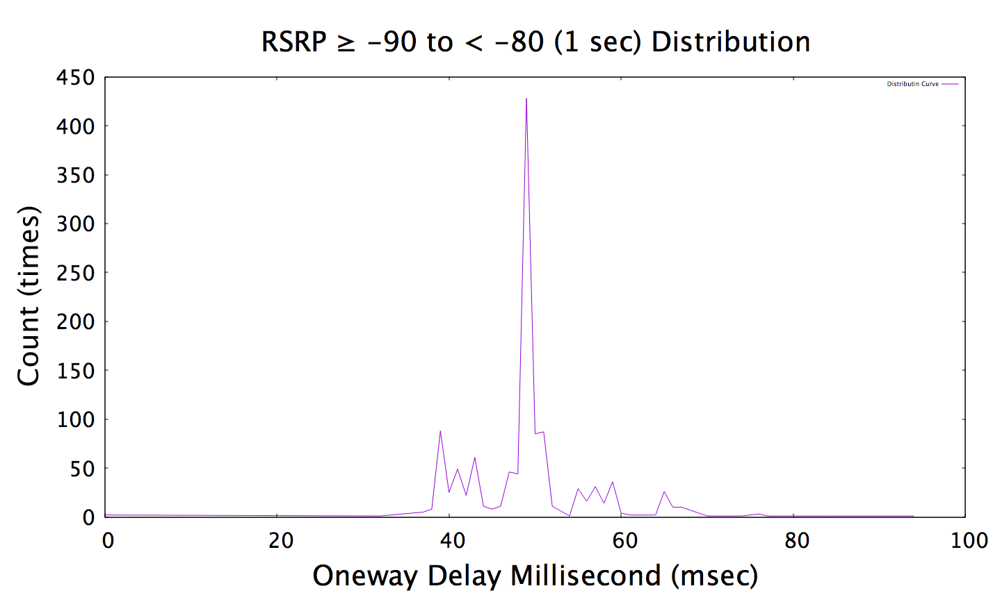
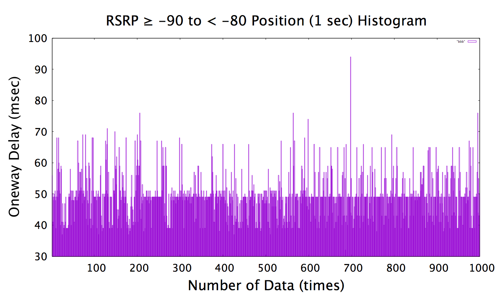

# Gnuplot for Distribution and Histogram

### File
| README.md | README |
| ------ | ------ |
| Histogram.cpp | Generate appropriate output file for *gnuplot_script_his*. |
| Distribution.cpp | Generate appropriate output file for *gnuplot_script_dis*. |
| gnuplot_script_his| For plotting histogram |
| gnuplot_script_dis | For plotting distribution |

### Steps
>Execute *Histogram* will generate input file for *gnuplot_script_his* as well as the input file for *Distribution.cpp*.
>Execute *Distribution* to generate file for *gnuplot_script_dis*.
>Note that you will have to setup file name mannualy.

###Sample

Distribution Sample:

Histogram Sample:

